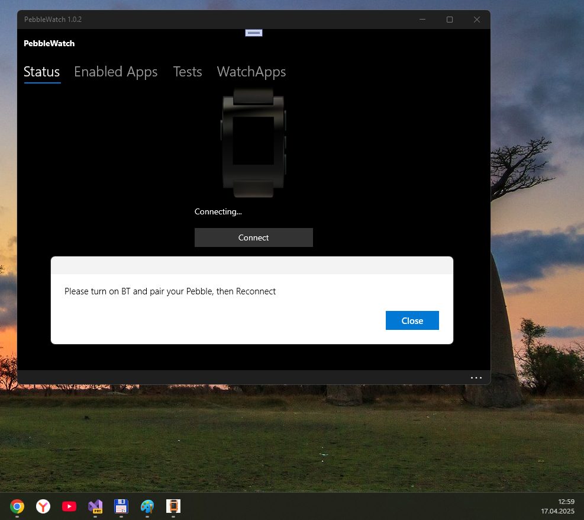

# Pebble-W10M 1.0.2.0 - master branch

My fork of Pebble UWP app for Windows 10 Mobile for some R&D . 

## About this "old new thing" / Status
- Alpha version , Expect issues, code inconsistency, spaghetti code, etc, etc... 
- POC/Alpha state. Pebble & Windows 10 Mobile. Video: https://www.youtube.com/watch?v=OrZWzFiJ0pw
- Min. Win. SDK = 10240

## Screenshot(s)

## My 2 cents
- Minimal code refresh :)
- Build status is OK, app start - success .

# Status of my Pebble-W10M fork
Still a WIP... whenever… forever….

## What works?
- Connection to the pebble
- Sending test packages (Ping, Notification, Set time, etc).
- Retrieve background notifications from the Accessory Manager (Calls,SMS,Music info., emails.. anything).
- Never closes the connection (need to know why it only sends the Music Info to the pebble after ~8min).
- Retrieve Installed Pebble Apps
- Install Pebble Apps from the Pebble Store Website (Only 2.x firmware ATM).

## What doesn't?
- Pebble Music Controls stops after ~7min of being initialized.
- If we want the progress bar in the Pebble Music App, we need to find a way to get AVRCP Working correctly. (IOS RemoteCaps)
- If we want the Music Controls to work, we lose the progress bar. (Android RemoteCaps).
- Remotely launch Pebble Apps.
A lot of things.. still a WIP.

## Known problems
You may see some random Toast Notifications about the SocketActivityTriggerDetails (was testing any posibility to get this thing to work).

## License
Licensed by the GNU General Public License 3 available here https://raw.githubusercontent.com/bitrvmpd/Pebble-W10/master/LICENSE

## References & Credits- https://github.com/bitrvmpd/Pebble-W10M Original project
- https://github.com/bitrvmpd Eduardo Noyer aka bitrvmpd, author &developer of original project 
- This program uses a modified [P3bble Library](https://github.com/p3root/P3bble)

## ..
As is. No support. RnD only. DIY

## .
[m][e] April 2025

